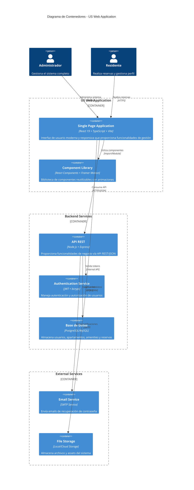

# Modelo C4 - Nivel 2: Diagrama de Contenedores
## US Web Application - Arquitectura de Contenedores

### Descripción de la Arquitectura
El sistema **US Web Application** está compuesto por múltiples contenedores que trabajan en conjunto para proporcionar una solución completa de gestión de consorcio.

### Diagrama de Contenedores



### Detalle de Contenedores

## 🖥️ Frontend - Single Page Application (SPA)

### Tecnologías Principales
- **React 19**: Framework de UI moderno con hooks y context
- **TypeScript**: Tipado estático para mayor robustez
- **Vite**: Bundler rápido para desarrollo y build
- **React Router Dom**: Navegación client-side
- **Framer Motion**: Animaciones fluidas y transiciones

### Características Técnicas
- ✅ **Responsive Design**: Mobile-first con Tailwind CSS
- ✅ **Component Architecture**: Componentes reutilizables y modulares
- ✅ **State Management**: React hooks + localStorage para persistencia
- ✅ **API Integration**: Fetch API con manejo de errores robusto
- ✅ **Real-time UI**: Actualizaciones inmediatas de estado

### Módulos Principales

#### 🔐 Authentication Module
```typescript
// Componentes: Login, Register, ResetPassword
// APIs: /auth/login, /auth/register, /auth/reset-password
// Funcionalidades: JWT handling, password recovery
```

#### 👥 User Management Module  
```typescript
// Componentes: ProfilePanel, EditProfileModal, ChangePasswordModal
// APIs: /user/name, /user/password, /user (DELETE)
// Funcionalidades: CRUD de perfil, cambio de contraseña
```

#### 🏢 Admin Dashboard Module
```typescript
// Componentes: AdminDashboard, UserManagement, ApartmentManagement
// APIs: /admin/stats, /admin/users, /admin/apartments
// Funcionalidades: Gestión completa del sistema
```

#### 🏠 Tenant Dashboard Module
```typescript
// Componentes: TenantDashboard, ReservationList, TimeSelector
// APIs: /reservations, /amenities, /dashboard
// Funcionalidades: Reservas y gestión personal
```

## 🔧 Backend API REST

### Arquitectura de API
- **Base URL**: `http://localhost:3000/api` (desarrollo)
- **Authentication**: JWT Bearer tokens
- **Format**: JSON request/response
- **HTTP Methods**: GET, POST, PUT, PATCH, DELETE

### Endpoints Principales

#### 🔐 Authentication Endpoints
```javascript
POST /auth/login           // Autenticación de usuario
POST /auth/register        // Registro de nuevo usuario  
POST /auth/forgot-password // Recuperación de contraseña
POST /auth/reset-password  // Reset de contraseña con token
```

#### 👤 User Endpoints
```javascript
GET  /dashboard           // Datos del dashboard del usuario
PATCH /user/name         // Actualizar nombre del usuario
PATCH /user/password     // Cambiar contraseña
DELETE /user             // Eliminar cuenta del usuario
```

#### 👨‍💼 Admin Endpoints
```javascript
GET  /admin/stats        // Estadísticas del sistema
GET  /admin/users        // Lista de todos los usuarios
PUT  /admin/users/:id/role // Cambiar rol de usuario
GET  /admin/apartments   // Gestión de apartamentos
GET  /admin/amenities    // Gestión de amenities
GET  /admin/reservations // Todas las reservas del sistema
```

#### 🏢 Reservations & Amenities
```javascript
GET  /reservations                    // Reservas del usuario
POST /reservations                    // Crear nueva reserva
GET  /reservations/amenity/:id        // Reservas por amenity
DELETE /reservations/:id              // Cancelar reserva
GET  /amenities                       // Lista de amenities disponibles
```

## 🏗️ Component Library

### Componentes de UI Reutilizables

#### 📅 Date & Time Components
```typescript
ModernDatePicker    // Selector de fechas con calendario
ModernTimePicker    // Selector de horarios
TimeSelector        // Componente complejo de selección temporal
```

#### 🎨 UI Components
```typescript
LoadingSpinner      // Indicadores de carga
Header              // Barra de navegación principal
ProfilePanel        // Panel lateral de perfil
LogoutSuccessToast  // Notificaciones de éxito
```

#### 📝 Form Components  
```typescript
EditProfileModal     // Modal de edición de perfil
ChangePasswordModal  // Modal de cambio de contraseña
ForgotPasswordModal  // Modal de recuperación
```

### Patrones de Diseño Implementados

#### 🚦 API Integration Pattern
```typescript
// Patrón consistente para llamadas API
try {
  setLoading(true);
  const response = await fetch(endpoint, config);
  const data = await response.json();
  if (!response.ok) throw new Error(data.message);
  return data;
} catch (error) {
  setError(error.message);
} finally {
  setLoading(false);
}
```


### 🔒 Seguridad y Validación

#### Authentication Flow
1. **Login**: Usuario ingresa credenciales → API valida → JWT token generado
2. **Token Storage**: JWT almacenado en localStorage del browser
3. **API Calls**: Token incluido en Authorization header
4. **Validation**: Backend valida token en cada request
5. **Logout**: Token removido del localStorage

#### Role-Based Access Control
```typescript
// Roles disponibles
type UserRole = 'admin' | 'tenant' ;

// Control de acceso por componente
const Dashboard = () => {
  const userRole = userData?.user?.role;
  
  if (userRole === 'admin') return <AdminDashboard />;
  return <TenantDashboard />;
};
```
