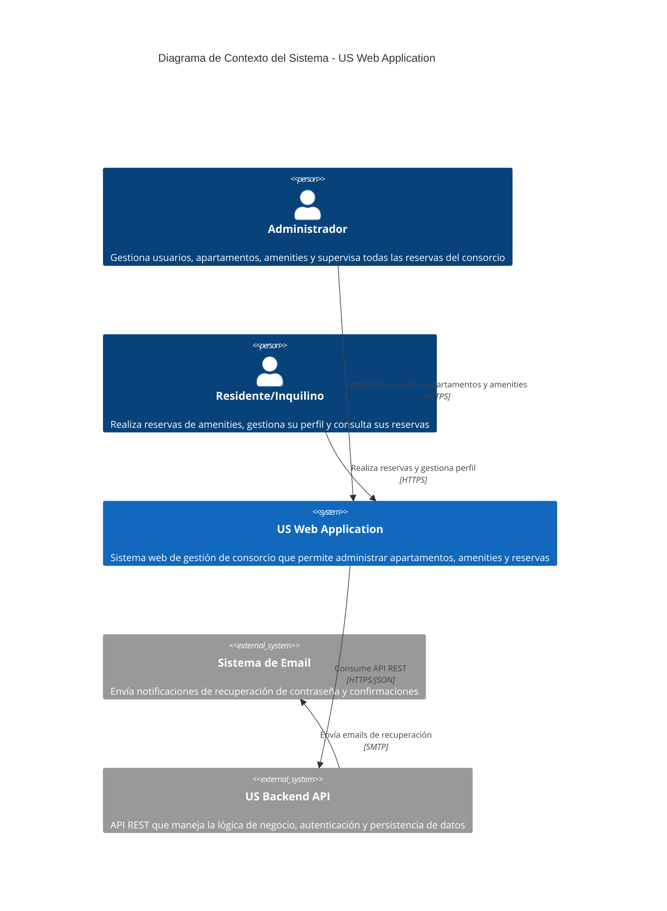

# Modelo C4 - Nivel 1: Diagrama de Contexto del Sistema
## US Web Application - Sistema de Gestión de Consorcio

### Descripción del Sistema
El **US Web Application** es un sistema de gestión de consorcio que permite a administradores y residentes gestionar apartamentos, amenities y reservas de espacios comunes de manera eficiente.

### Actores y Sistemas Externos

### Interacciones Principales

#### 👨‍💼 Administrador
- **Gestión de Usuarios**: CRUD completo de usuarios (residentes, propietarios)
- **Gestión de Apartamentos**: Administra información de unidades habitacionales
- **Gestión de Amenities**: Configura espacios comunes (piscina, gimnasio, salón, etc.)
- **Supervisión de Reservas**: Monitorea todas las reservas del sistema
- **Estadísticas**: Accede a dashboards con métricas del consorcio

#### 🏠 Residente/Inquilino
- **Reservas de Amenities**: Realiza y gestiona reservas de espacios comunes
- **Gestión de Perfil**: Actualiza información personal y contraseña
- **Consulta de Disponibilidad**: Visualiza horarios disponibles en timeline
- **Historial de Reservas**: Consulta y cancela reservas propias

### Sistemas Externos

#### 🔧 US Backend API
- **Autenticación JWT**: Manejo seguro de sesiones de usuario
- **API REST**: Endpoints para todas las operaciones CRUD
- **Autorización**: Control de acceso basado en roles (admin/tenant)
- **Validación**: Reglas de negocio y validación de datos

#### 📧 Sistema de Email
- **Recuperación de Contraseña**: Envío de tokens de reset
- **Notificaciones**: Confirmaciones de registro y operaciones importantes

### Beneficios del Sistema
- ✅ **Centralización**: Toda la gestión del consorcio en una plataforma
- ✅ **Eficiencia**: Automatización de reservas y gestión de espacios
- ✅ **Transparencia**: Visibilidad completa de disponibilidad y reservas
- ✅ **Accesibilidad**: Interfaz web responsive para cualquier dispositivo
- ✅ **Seguridad**: Autenticación robusta y control de acceso por roles